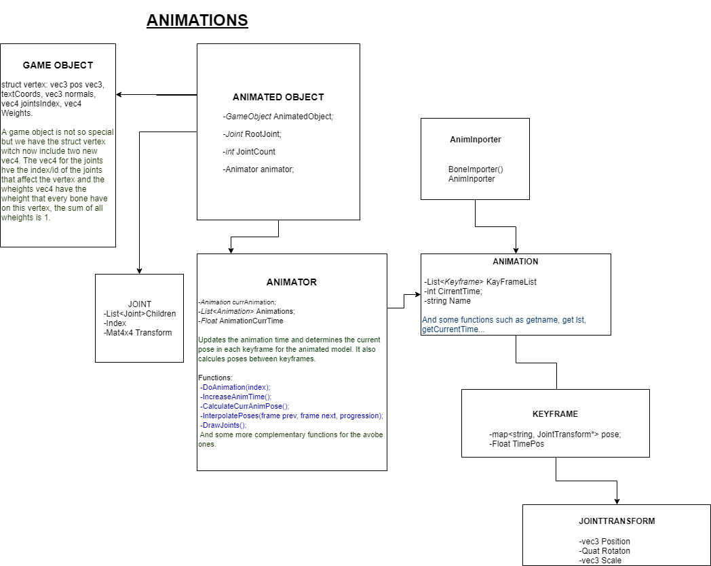

# Mercury Engine

<iframe width="640" height="480" src="https://www.youtube.com/embed/qAw3V35vyvA" frameborder="0" allow="accelerometer; autoplay; encrypted-media; gyroscope; picture-in-picture" allowfullscreen></iframe>

[Mercury engine](https://github.com/knela96/Mercury-Engine) is a videogames engine university project for UPC-CITM. This project pretends to create an
engine witch is able to load, import and play animations from fbx models that have been animated in an external animation software such as maya, blender 
or 3DsMax. 
This s a group project by [Eric Canela Sol](https://github.com/knela96) and [Jaume Avinyó Sedano](https://github.com/Jaumeavinyo). We are third year students
in the programming and videogame developement Bachalor Degree in UPC-CITM.

## Team photos

**Eric Canela** ([Github](https://github.com/knela96))

**Jaume Avinyó** ([Github](https://github.com/Jaumeavinyo))

### Jaume Avinyó
- fbx importer and Game object structure
- console + its functionalities
- Engine state info such as fps, modules configuration's variables, hardware detection and software versions for all libraries used
- GameObjects Hierarchy (a part)
- Inspector for gameobjects
- Basic shapes loading
- Animations (Mostly done in group)

### Eric Canela
- fbx importer and DDS teture format importer
- Drag and drop files to the engine
- GameObjects transforms
- GameObjects Hierarchy (most of it)
- most of the engine's Imgui menus
- Camera Component with modifiable fov and frustrum
- Scene resizable
- AABBs for gameobjects
- Safe and load in own format
- Animations (Mostly done in group)

## Sub-systems
- Camera: Can create a camera which has a component camera, where you can activate the camera culling and change the fov.
- File System: Every time a file is being dropped in the engine, it stores the file in a own file format to make it faster to read, loading all the info and also maintaining a relation with a .meta file for each file (Models and Textures)
- Importer
  - Material: It load the texture of each model we are importing to store it as a resource and use it later the times we need
  - Mesh: Loads a Mesh of a mesh and gets all the models data (vertices, indices, texture coords) to use it later for each object in the Engine.
  - Bones: It loads all the bones of each mesh of the model, and stores them individually with its weights and the vertices they are affecting each bone.
  - Animations: It loads the animations of the model with all the keyframes of each bone.
- Renderer: It renders the models in current time, having the ability to choose in execution time some configurations of render(Depth, Culling, Colors, Textures) enabling and disabling them.
- Resources: Each Mesh, Material, GameObject is stored in separated files with our file format and loaded once in memory.
- Animator: The animator controls the animations of each object, it executes and bind in pose the model every frame, controlling the time of the animation and the positions of the bones that will change the position of the mesh.

## Animation System

So, as it can be seen in the image avobe, the animator is the core of this animations system. It contains all the animations
and you can choose whitch you want t reproduce calling DoAnimation(index) with the position on the list of the animation, this 
function just sets as the current animation the animation that you are passing with the index.
As Animator is a component, it has a Update function called every frame, in this function we are doing our core actions and to work we need
to do two things: Increase the current time of the animation, wich are the frames and Calculate the CurrentAnimationPose,
to do this we enter into the currAnimation wich is type Animation and we take the keyframes information
at the current time. 
We do not have keyframes for every time in the timeline, so we will need to calculate interpolation poses between keyframes,
this will be Animator's work.

Every joint has a list of children, a transform matrix and a index, wich matches the order in wich the joint is stored in te joints list. This index is used
by vertexes in the renderer to know wich bone is afecting them and wich trasformations should they take

So the list of keyframes inside animation is a std::map, this can store a list of joints(bones) with their names and transformations stored in a class JointTransform, wich 
has position, scale and rotation.
The animated object is the one that is animated by the Animator, this has a RootJoint that contains the root joint. Every Joint has a 
transform and a list of its childrens so also the root joint has this list. This is very usefull to create the hierarchy system of bones. joints also
have a index wich is very usefull because as I said before, vertexes need to know wich bone is afecting them.

The importer fills the animation list and their frames ussing assimp "aiAnimation", bones are loaded with aiBone and the last thing you need to load is every vertex influences.

## Download Engine
[Github Repository](https://github.com/knela96/Mercury-Engine)

[Release Link](https://github.com/knela96/Mercury-Engine/releases)

## License
Copyright <2019> <Mercury Engine Studios by Eric Canela Sol and Jaume Avinyo Sedano>

Permission is hereby granted, free of charge, to any person obtaining a copy of this software and 
associated documentation files (the Software), to deal in the Software without restriction, including 
without limitation the rights to use, copy, modify, merge, publish, distribute, sublicense, and/or sell
copies of the Software, and to permit persons to whom the Software is furnished to do so, subject to 
the following conditions:The above copyright notice and this permission notice shall be included in all
copies or substantial portions of the Software.THE SOFTWARE IS PROVIDED -AS IS-, WITHOUT WARRANTY OF 
ANY KIND, EXPRESS OR IMPLIED, INCLUDING BUT NOT LIMITED TO THE WARRANTIES OF MERCHANTABILITY, FITNESS 
FOR A PARTICULAR PURPOSE AND NONINFRINGEMENT.IN NO EVENT SHALL THE AUTHORS OR COPYRIGHT HOLDERS BE LIABLE
FOR ANY CLAIM, DAMAGES OR OTHER LIABILITY, WHETHER IN AN ACTION OF CONTRACT, TORT OR OTHERWISE, ARISING
FROM, OUT OF OR IN CONNECTION WITH THE SOFTWARE OR THE USE OR OTHER DEALINGS IN THE SOFTWARE.
